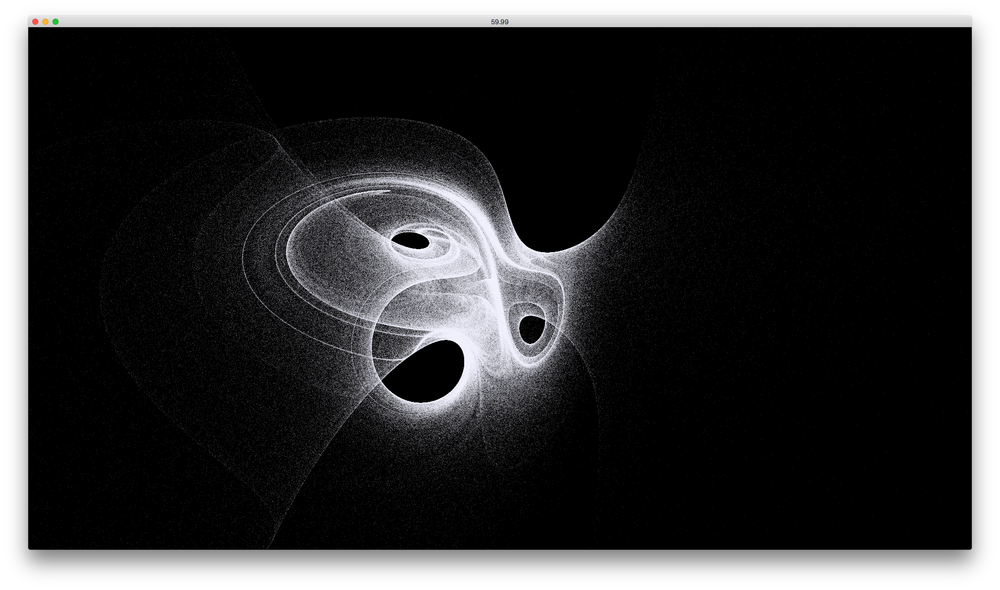

# ofxFastParticleSystem

OpenFrameworks addon for GPU particle system written in GLSL with the possibility to use different update shader.

Based on the great [ofxGpuParticleSystem](https://github.com/neilmendoza/ofxGpuParticles).

With ofxFastParticleSystem, we add the possibility to use a separate update and draw shader to be more clear and scalable using separate shaders files.

This addon is the core for our interactive multimedia performance [Dökk](https://www.fuseworks.it/en/works/dokk/).

## Compatibility

Tested with OpenFrameworks 0.9.8 and 0.10.0.

## Examples

See the examples:

- example-SimpleRandom
- example-StrangeAttractor

### example-SimpleRandom

In this example, you can see how to declare a particle system with two separate update shaders and one draw shader. You can add how many update and draw shaders you need.

This is just an example to show you how to use ofxFastParticleSystem.

#### How to use

You can change the update shader pressing *0* or *1*.

#### 1) Declare a const string to identify your shader

```c++
const string CIRCLE = "circle";
```

#### 2) Add the shader to the particle system

To add an update shader:

```c++
addUpdateShader(string shaderName, string key)
```

To add a draw shader:

```c++
addDrawShader(string shaderName, string key)
```

To add our *CIRCLE* update shader:

```c++
particles.addUpdateShader("shaders/updateParticlesCircle", CIRCLE);
```

#### 3) Retrieve update shader

On the update method retrieve the update shader you want to use. If you don't specify the *shaderKey*, the default update shader is used:

```c++
ofShader &shader = particles.getUpdateShader(CIRCLE);

shader.begin();
shader.setUniform2f("center", ofGetWidth() / 2.0, ofGetHeight() / 2.0);shader.setUniform1f("radius", 300);
shader.setUniform1f("centerStiffness", 0.01);
shader.setUniform1f("maxSpeed", 20);
shader.end();
```

#### 4) Call update method

```c++
particles.update(CIRCLE);
```

#### 5) Retrive draw shader

Like for udpate shader you have to retrive your draw shader:

```c++
ofShader &shader = particles.getDrawShader();
```

#### 6) Retrive draw shader

To draw your particle system you have to call the draw method

```c++
particles.draw();
```

---

### example-StrangeAttractor

In this example, you can see an interesting visualization with several million particles.

You can interact with the particle system with mouse x position.




